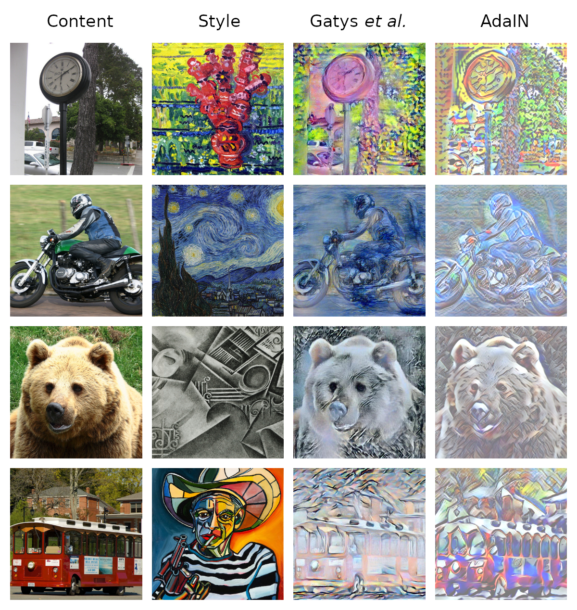

# adaIN-style-transfer

This is a pytorch implementation of Adaptive Instance Normalization (AdaIN) arbitrary style transfer, as outlined in [Arbitrary Style Transfer in Real-time with Adaptive Instance Normalization](https://arxiv.org/abs/1703.06868) by Xun Huang and Serge Belongie.

Additionally, the *optim_neural_style* folder contains a pytorch implementation of [A Neural Algorithm of Artistic Style](https://arxiv.org/abs/1508.06576) by Leon A. Gatys, Alexander S. Ecker, and Matthias Bethge. This method was used as a means of comparison with AdaIN style transfer.

Note that our AdaIN model was trained on limited hardware and limited time. Training on a larger dataset for longer would likely produce a better result. The model that produced these AdaIN images can be found in ***models/best_model.pth***.

More details about this project can be found in [report.pdf](report.pdf).

## Contributors

* [Hersh Vakharia](https://github.com/hvak)
* Anthony Weihao Ke
