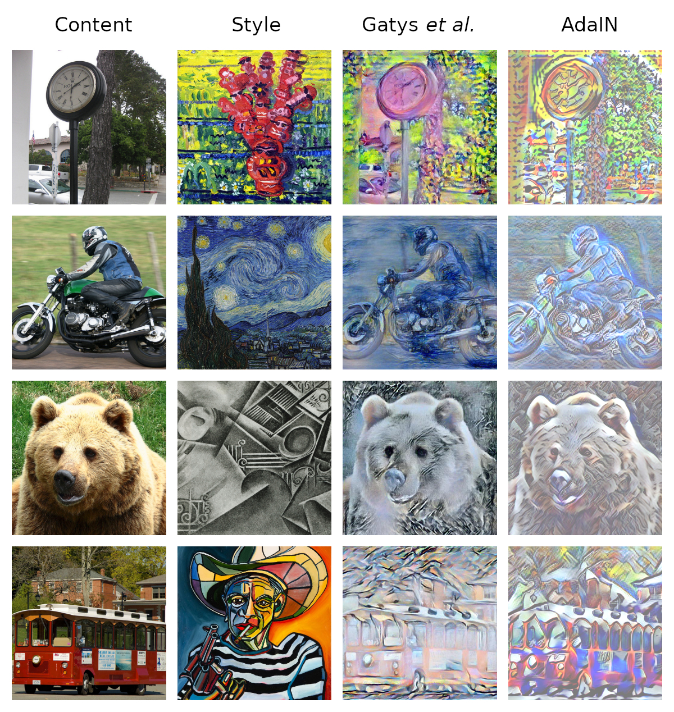

# adaIN-style-transfer

This is a PyTorch implementation of Adaptive Instance Normalization (AdaIN) arbitrary style transfer, as outlined in [Arbitrary Style Transfer in Real-time with Adaptive Instance Normalization](https://arxiv.org/abs/1703.06868) by Xun Huang and Serge Belongie.

Additionally, the *optim_neural_style* folder contains a PyTorch implementation of [A Neural Algorithm of Artistic Style](https://arxiv.org/abs/1508.06576) by Leon A. Gatys, Alexander S. Ecker, and Matthias Bethge. This method was used as a baseline for comparing performance against AdaIN.



*Note that our AdaIN model was trained on limited hardware and limited time. Training on a larger dataset for longer would likely produce a better result. The model that produced these AdaIN images can be found in `models/best_model.pth`.*

More details about this project's architecture, methodology, and results can be found in [report.pdf](report.pdf).

## Prerequisites
- Python 3.x
- [PyTorch](https://pytorch.org/) & Torchvision
- Pillow
- Matplotlib, Numpy

## Setup and Usage

### Generating Style Transfers (Inference)
The project comes with a pre-trained AdaIN model. To run style transfer on your own images:

1. Place your base (content) images inside `test_set/content/` (e.g. `img0.jpg`, `img1.jpg`, etc.).
2. Place your target style images inside `test_set/style/` matching the same naming format or sequence count.
3. Edit the `num_images` variable in `test.py` to match the number of pairs you wish to process.
4. Run the test script:
   ```bash
   python test.py
   ```
5. The combined, stylized output images will be generated and saved in `test_set/results/`.

### Training the Model
To train the model from scratch on a new dataset:
1. Place your content training dataset in `train_set/content/`
2. Place your style training dataset in `train_set/style/`
3. Execute `python train.py`

## Contributors

* [Hersh Vakharia](https://github.com/hvak)
* Anthony Weihao Ke
